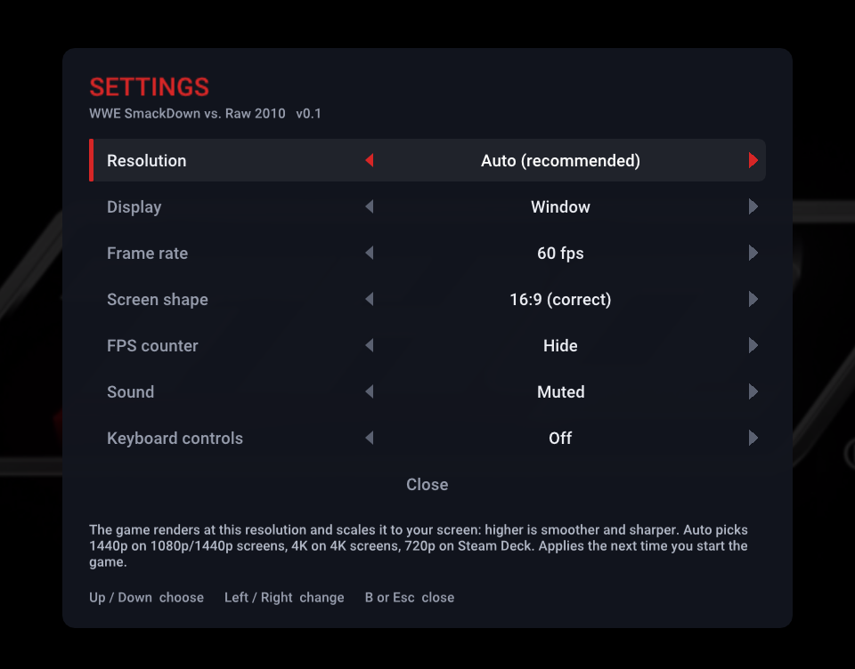
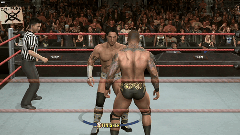

# WWE SmackDown vs. Raw 2010 — native PC, Linux & Steam Deck

The Xbox 360 version of **WWE SmackDown vs. Raw 2010**, running natively on Windows, and on Linux
and the Steam Deck through Proton: no emulator. The game's own program is recompiled to run
directly on your PC, and its graphics go through a native Vulkan renderer, at 60 fps and up to 4K.

**The goal is simple: bring the game back so people can play it again, natively on PC at 60 fps.**
It's the same game you remember, with no mods, roster changes or reworked gameplay. The only changes
are the ones it needs to run well on today's hardware: a native renderer, a steady 60 fps (using the
game's own 60 fps mode, so everything plays at the right speed), higher resolutions and faster
loading.

> **You need your own copy of the game.** None of the files from the game disc are in this project
> or its downloads, and nothing is ever downloaded for you: the game runs from a disc image
> (`.iso`) made from your own SvR 2010 disc. It does not condone piracy: please buy the game.

> **No installer, no launcher.** Put your `.iso` in the game's folder and run **`svr2010.exe`**. In
> game, **F1** (or **Back + Start** on a controller, **View + Menu** on the Steam Deck) opens the
> settings menu.

> **Work in progress.** This port gets regular updates, and bugs are fixed as they're found and
> reported, so don't expect a finished port yet. If you run into a problem, please
> [open an issue](https://github.com/nefariousjosiah/WWE-SVR2010-RECOMP/issues) with your graphics
> card, `game.log` from the game's folder and a screenshot.



## Showcase

<p align="center">
  
  
  
</p>

## Features

- **Native, not emulated.** The game's PowerPC code is statically recompiled to x86-64
  ([ReXGlue](https://github.com/rexglue/rexglue-sdk)), and the game's own Direct3D calls are drawn
  by a native Vulkan renderer (adapted from [re:Blue](https://github.com/zolaware/reblue)) with
  the game's shaders recompiled ahead of time. No GPU emulation.
- **60 fps** in menus and matches, using the game's own 60 fps mode so game speed stays right
  (the original 30 fps is one setting away).
- **Runs on lower-end PCs too.** The game draws its crowd in thousands of small pieces, and on
  slower processors that used to cost frames in entrances and crowd shots. The renderer now does
  far less work per frame: the graphics driver's work runs on its own thread, and textures,
  geometry and shader settings are only sent again when they change. A GTX 1060 with an i7-8700
  that dropped to the 40s in some entrances now holds 60 fps.
- **Up to 4K.** Internal resolution follows your screen: 1440p on 1080p and 1440p monitors, 4K on
  4K monitors, 720p on the Steam Deck. Or pick 720p / 1440p / 4K yourself. 16x anisotropic
  filtering.
- **Sharper image:** the game's own edge-blur filter (the console's cheap anti-aliasing, which
  smeared hair, tattoos, ropes and the crowd) is off; the higher internal resolution smooths edges
  instead. `svr_edge_blur = true` in `svr2010.toml` brings the original look back.
- **In-game settings menu:** F1, or Back + Start on a controller (Share + Options on PlayStation): resolution, fullscreen or
  window, 60 or 30 fps, screen shape, FPS counter, sound and keyboard controls. Saved for next
  time.
- **Updates in the game, when you want them:** a new version is announced at startup and installed
  from the settings menu only if you choose to. Your saves are kept and backed up first (see
  [Updating](#updating)).
- **Linux and Steam Deck** through Proton, Steam's compatibility layer: put your disc image in the
  game's folder and run the game. On the Deck: 720p at 60 fps, the correct 16:9 shape (or
  stretched to fill).
- **Faster loading:** matches load in about 15 seconds instead of over a minute (the game
  paced its loading for the console's DVD drive).
- **Plays straight from your disc image**: nothing is extracted or installed.
- **DLC:** if you own SvR 2010's downloadable content, drop your own package files into the `dlc`
  folder and it's in the game (see [DLC](#dlc-optional)).
- **Controllers** (Xbox, PlayStation, Switch Pro, the Deck's controls) through SDL. Keyboard controls
  are included but not tested yet, so a controller is recommended.

## What you need

- **Your own SvR 2010 disc image**, USA / Europe release (one release for both regions: title ID
  `54510844`, media ID `518DE415`, about 7.3 GB). Other releases aren't supported
  yet.
- **Windows 10 or 11, 64-bit**, and a graphics card with **Vulkan** support (AMD, NVIDIA or Intel,
  with a recent driver). Or **Linux** with Steam (Proton) and Vulkan drivers, such as a
  **Steam Deck**.
- About 130 MB for the program, plus your disc image.

## Windows: install and play

1. Download `SVR2010-NATIVE.zip` from the
   [Releases](https://github.com/nefariousjosiah/WWE-SVR2010-RECOMP/releases) page (under
   *Assets*; not *Source code*, which is the developer source).
2. Extract it to a folder of its own, for example `C:\Games\SVR2010-NATIVE`
   (not inside `Program Files`).
3. Copy your `.iso` into that folder, next to `svr2010.exe`.
4. Run **`svr2010.exe`**. The game finds the disc image by itself and starts.

Good to know:

- **Settings:** press **F1** in game (or **Back + Start** on a controller, **Share + Options** on PlayStation) for the settings menu:
  resolution (Auto, 720p, 1440p, 4K), fullscreen or window, 60 or 30 fps, screen shape, FPS
  counter, sound and keyboard controls. They are saved in `svr2010.toml`.
- **"Windows protected your PC"**: the program isn't code-signed. Click *More info* and then
  *Run anyway*.
- **Quitting:** close the game window (Alt+F4 or the close button).
- **Saves** live in the `userdata` folder. Back it up to keep your career and created superstars.
- **Updates:** from v0.5 on, the game can update itself when you choose to: see
  [Updating](#updating).
- **Disc image somewhere else?** If there's no `.iso` in the folder, the game asks for one the
  first time and remembers it.

### Controls

**A controller is recommended**; plug it in before starting. Keyboard controls are currently not
tested yet. Their default layout (rebind with **F4** in game):

| Controller | Keyboard | | Controller | Keyboard |
|---|---|---|---|---|
| A | Space / ; | | Left stick | W A S D |
| B | Backspace / ' | | Right stick | Arrow keys |
| X | L | | D-pad | Shift + arrow keys |
| Y | P | | LB / RB | 1 / 3 |
| Start | Enter / X | | LT / RT | Q / E |
| Back | Tab / Z | | Stick presses | F / K |

**F1** (or **Back + Start**) opens the settings menu; **F2** shows or hides the FPS counter.

## Updating

The game can update itself, but only when you choose to:

- **At startup** it asks GitHub, in the background, whether a newer version of this port is out.
  If there is one, a notice shows for a few seconds. Nothing is downloaded yet.
- **To update,** open the settings menu (**F1**, or **Back + Start** on a controller), go down to
  **Update** and press **A** (or Enter), then once more to confirm. It backs up your saves,
  downloads the new version, checks it and installs it. Then choose **Restart now**.
- **Your saves are kept.** The `userdata` folder (saves, profiles, created superstars, installed
  DLC) is never changed, and before every update your saves are also copied to
  `save_backups\<version>_<date>` in the game's folder. Your settings (`svr2010.toml`), your `dlc`
  folder and your disc image are kept too. If something goes wrong partway, the update stops and
  the version you had is put back.
- **Rather not?** Set **Check for updates** to *Off* in the settings menu and the game never
  goes online. The check only asks GitHub for this project's latest release; nothing about you or
  your PC is sent.
- **Coming from v0.4 or older:** download the new zip once by hand (see
  [Windows: install and play](#windows-install-and-play)); from v0.5 on, the game does it.

## DLC (optional)

SvR 2010's downloadable content works too. **None of it is included: you need your own DLC**,
the package files from your own Xbox 360 (copied off its hard drive, for example with a USB stick
and a tool such as Horizon or Velocity). They're the files with long hexadecimal names from the
console's `Content\0000000000000000\54510844\00000002\` folder.

1. Copy the package files into the `dlc` folder next to `svr2010.exe` (any subfolder is fine).
2. Start the game. The first start with new DLC unpacks it into `userdata` (a few seconds); after
   that the DLC content is in the game.

Files that aren't SvR 2010 DLC are ignored. Once installed, the files in `dlc` can be deleted to
save space (keep `userdata`). It works the same on the Steam Deck.

## Linux and Steam Deck (Proton): install and play

On Linux the Windows release runs through Proton, Steam's compatibility layer; there's no separate
Linux build. The Steam Deck is the tested setup and holds 60 fps; other Linux PCs with Steam and
up-to-date Vulkan drivers should work the same way. With your disc image in the same folder as `svr2010.exe`, the
game finds it by itself.

The steps below are for the Steam Deck. On another Linux PC, do the same in Steam's desktop
client and skip the Desktop Mode and Game Mode parts.

**In Desktop Mode** (press the Steam button, *Power*, *Switch to Desktop*):

1. **Get the release.** Download `SVR2010-NATIVE.zip`
   (under *Assets*, not *Source code*) with a browser, or copy it from your PC together with your
   disc image. A USB stick for the copy must be **exFAT or NTFS**: the disc image is bigger than
   FAT32's 4 GB file limit.
2. **Extract it.** In the *Dolphin* file manager, make a folder such as
   `/home/deck/Games/SVR2010-NATIVE`, right-click the zip, *Extract*, *Extract archive to...*,
   and choose that folder. (A microSD card works too.)
3. **Add your disc image.** Copy your `.iso` into that folder, next to `svr2010.exe`.
4. **Add it to Steam.** Open Steam (desktop), then *Games* > *Add a Non-Steam Game to My
   Library...* > *Browse...*. Set the file type filter to *All files*, pick `svr2010.exe` in your
   folder, then *Add Selected Programs*.
5. **Turn on Proton.** In your library, right-click *svr2010* > *Properties...* >
   *Compatibility*, tick *Force the use of a specific Steam Play compatibility tool* and choose
   **Proton Experimental** (or the newest Proton). While you are there, rename the shortcut to
   *WWE SmackDown vs. Raw 2010*.

**Back in Game Mode** (the *Return to Gaming Mode* icon on the desktop):

6. Start it from *Library* > *Non-Steam*. The game starts fullscreen at 720p and 60 fps. To quit,
   press the Steam button and *Exit game*.

Notes for the Deck:

- **The first start** takes a little longer while Proton sets itself up.
- **Settings:** press **View + Menu** together (the two buttons left and right of the screen) to
  open the settings menu. To open it with the top-left back button instead: the game's
  *Controller settings* > *Edit Layout* > *Back Grip Buttons* > **L4** > *Keyboard* > **F1**.
- **Black bars:** the game is 16:9 and the Deck's screen is 16:10, so there are thin bars above
  and below. *Screen shape* > *Stretch to fill* in the settings menu fills the screen.
- **Controls:** the Deck's built-in controls work as an Xbox controller with Steam's default
  layout.
- **Artwork:** Steam's library artwork for the shortcut can be set from its properties.

## Known issues

- **Road to WrestleMania:** on NVIDIA graphics cards, the locker room door and the magazine on
  the chair can look see-through (speckled). It's cosmetic and is being looked into.

## Troubleshooting

| What happens | What to do |
|---|---|
| A window asks for a disc image | There's no `.iso` next to `svr2010.exe`: pick your disc image (it's remembered), or copy it into the game's folder. |
| The game closes right after starting | Check that your disc image is the USA / Europe release of SvR 2010 and complete. |
| Black screen, or the game closes | Update your graphics driver (the renderer needs Vulkan), then try again. If it keeps happening, open an issue with `game.log` from the game's folder. |
| It runs slowly | Make sure you have the latest version (v0.4 made a big difference on older processors). On a weak graphics card, **F1** > *Resolution* > **720p** or **1440p** (applies on the next start) needs less from it. If it still drops, open an issue with `game.log`, your processor and graphics card. |
| Windows blocks it | *More info* > *Run anyway* (the program isn't code-signed). |

## How it works

- **Recompilation.** [ReXGlue](https://github.com/rexglue/rexglue-sdk) translates the game's Xbox
  360 executable into C++ that is compiled for x86-64. The Xbox 360 system calls it makes are
  provided by the ReXGlue runtime, which also reads the game's data straight from your disc image.
- **Rendering.** Instead of emulating the Xbox 360 GPU, the renderer watches the game's own
  Direct3D library (statically linked into the game) and draws the same scenes through
  [plume](https://github.com/zolaware/plume) on Vulkan. The game's shaders are converted ahead of
  time with [XenosRecomp](https://github.com/zolaware/reblue-XenosRecomp). The emulated GPU only
  keeps the game's command stream moving.
- **60 fps.** The game has its own 60 fps mode, which it normally drops to 30 for matches; a hook
  keeps it at 60, so the game logic and the animations stay in step.

## Building from source

For developers; players use the releases. Windows, with about 30 GB free.

```
git clone https://github.com/nefariousjosiah/WWE-SVR2010-RECOMP.git
cd WWE-SVR2010-RECOMP
powershell -ExecutionPolicy Bypass -File tools\windows\setup.ps1 -Iso "D:\path\to\your disc image.iso"
```

`setup.ps1` installs the tools it needs (Git, CMake, Ninja, LLVM clang, Python, 7-Zip, Visual Studio
2022 Build Tools), fetches the third-party sources at the pinned commits and applies this project's
patches (`patches/`), builds the ReXGlue SDK, extracts your disc image to `assets/`, recompiles
`default.xex` and builds the game.

The native renderer also needs your game's shaders, which can't be in this repository. The first
time, `setup.ps1` builds a shader-dump version and tells you how to collect them: play the menus
and a match or two with shader dumping on, run `tools\native\build_shader_cache.ps1`, then run
`setup.ps1` again.

Afterwards: `tools\windows\build.ps1` rebuilds, `tools\windows\run.ps1` runs it, and
`tools\windows\package_release.ps1` makes the release zip (the game, no game
files; the version number comes from `CMakeLists.txt`).

Repository layout: `src/` the game-specific code (`native/` renderer glue, `reblue/` the renderer),
`config/` recompiler configuration, `patches/` changes to the third-party
sources, `tools/` build scripts, `docs/` the images on this page.

## Credits

- [ReXGlue SDK](https://github.com/rexglue/rexglue-sdk) by Tom Clay, derived from
  [Xenia](https://xenia.jp): the recompiler and runtime.
- [re:Blue](https://github.com/zolaware/reblue) (Blue Dragon), the renderer this one is adapted
  from, with [plume](https://github.com/zolaware/plume) and
  [XenosRecomp](https://github.com/zolaware/reblue-XenosRecomp).
- The settings menu: [Dear ImGui](https://github.com/ocornut/imgui) and the Roboto font;
  [SDL](https://libsdl.org) for controllers and sound.
- [zstd](https://github.com/facebook/zstd); the Press Start 2P font.
- Inside the runtime: [FFmpeg](https://ffmpeg.org) (audio),
  [libmspack](https://github.com/kyz/libmspack) and the other libraries the ReXGlue SDK uses.

Licences of all of these: [THIRD_PARTY.md](THIRD_PARTY.md).

## Licence and legal

This project's own code, including the native renderer for SmackDown vs. Raw, was written by
nefariousjosiah and is licensed under the GNU General Public License v3.0 ([LICENSE](LICENSE)). The
releases are covered by the same licence, and this repository is their source. It builds on
re:Blue's renderer core (BSD 3-Clause) and the other projects in [THIRD_PARTY.md](THIRD_PARTY.md),
which keep their own licences; the releases include FFmpeg and libmspack under the LGPL (their
source: see THIRD_PARTY.md). None of the files from the game disc are in this repository or the
releases: the game's data (models, textures, sound, video) comes from your own disc image. The
releases do contain the game's program in recompiled form (`svr2010.exe`, with the game's shaders
converted for PC).

WWE, SmackDown vs. Raw and all related names, characters, content and the gameplay shown in the
showcase clips belong to their respective owners (WWE, THQ, Yuke's); the clips are used only to show
the port running. This is an unofficial fan project, not affiliated with or endorsed by them or by
Microsoft.
